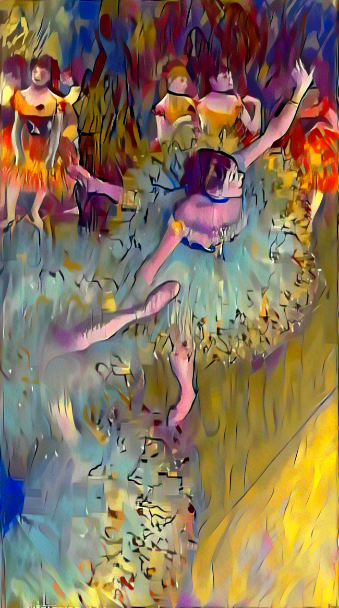

# image style transfer

Give 2 images to the algorithm an image to get the content and then an image to get the style 

<p align = 'center'>


<a href = 'bailarina-basculando-bailarina-verde_a_r_a.png'></a>
</p>

And you will get an image with the style of the other

## Execution

Execute with 
```
    python Style_transfer.py 
```

Args
```
   - '-c' : Path of the content image
   - '-s' : Path of the style image
   - '-ms' : Set the max size of the image

 
```